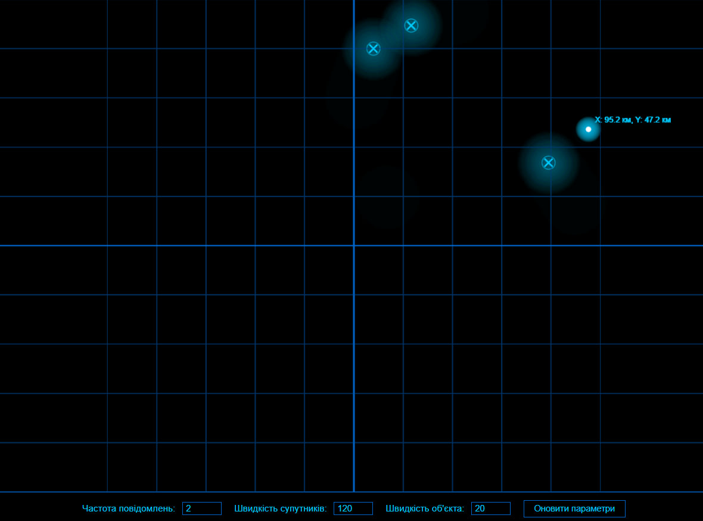
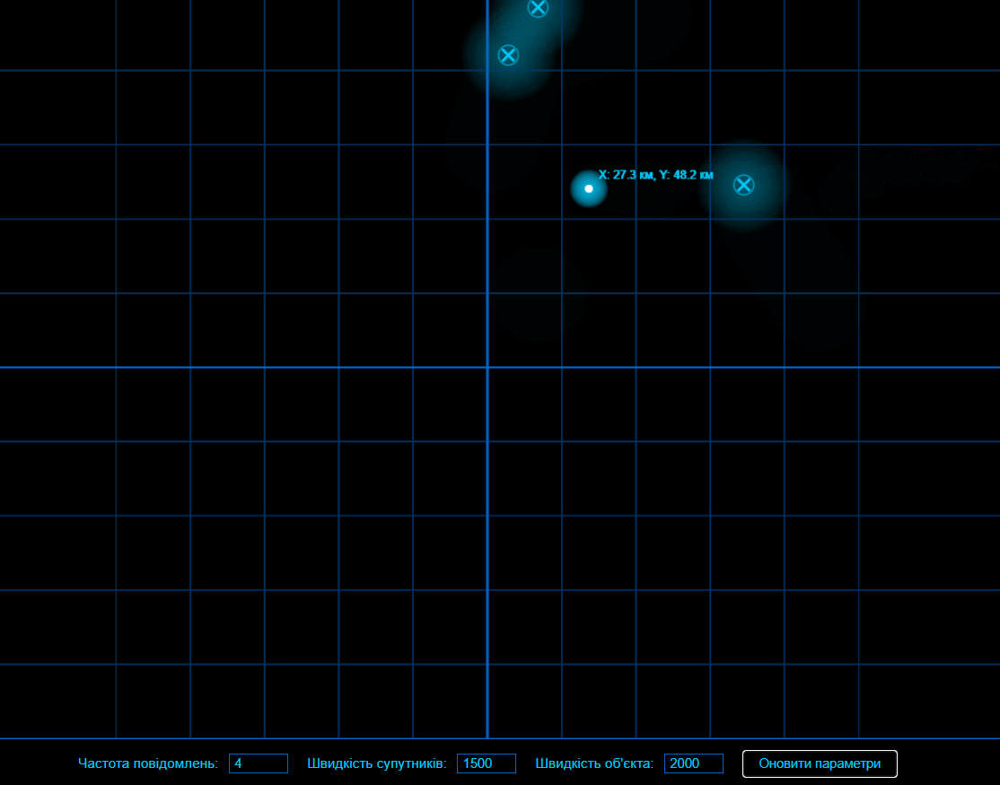

# Лабораторна робота №5: Розробка додатку для візуалізації вимірювань GPS

## Мета роботи
Розробити програму для моделювання руху об'єкта до заданої цілі з можливістю налаштування параметрів руху та візуалізацією процесу.

## Теоретичні відомості
У даній лабораторній роботі розглядається задача моделювання руху об'єкта до заданої цілі. Процес руху базується на математичних принципах визначення траєкторії та швидкості об'єкта. Для візуалізації використовується HTML Canvas, що дозволяє створювати динамічні графічні відображення. Програма надає можливість змінювати різні параметри руху, такі як швидкість об'єкта, точність досягнення цілі та інші характеристики, що впливають на траєкторію руху.

## Практична реалізація
Програму реалізовано як веб-додаток з використанням сучасних веб-технологій. Основою системи є JavaScript-код, який виконує всі необхідні обчислення для визначення положення об'єкта в кожний момент часу. Візуалізація здійснюється за допомогою HTML5 Canvas, що забезпечує плавне відображення руху. Для кращої демонстрації роботи програми рекомендується відвідати [CodePen](https://codepen.io/VolodimirProdan/full/azoZXvX), де представлена повністю інтерактивна версія проекту.

## Результати роботи програми

На рисунку 1 показано роботу програми з стандартними параметрами, де об'єкт рухається до заданої цілі по оптимальній траєкторії.

  
   
  <em>Рис. 1 - Демонстрація роботи програми з базовими параметрами</em>

На рисунку 2 продемонстровано роботу системи після модифікації параметрів руху, що дозволяє спостерігати альтернативні варіанти траєкторій та швидкості досягнення цілі об'єктом.

  
   
  <em>Рис. 2 - Візуалізація руху з зміненими параметрами</em>

## Висновки
У результаті виконання лабораторної роботи було створено функціональну систему моделювання руху об'єкта до цілі. Розроблений веб-додаток демонструє стабільну роботу та надає користувачу широкі можливості для експериментів з параметрами руху. Практичне значення розробленої системи полягає у можливості її використання для навчальних цілей при вивченні алгоритмів руху та для експериментів з різними траєкторіями досягнення цілі.

Для повного ознайомлення з можливостями системи рекомендується відвідати [інтерактивну версію](https://codepen.io/VolodimirProdan/full/azoZXvX) проекту на CodePen, де можна безпосередньо взаємодіяти з усіма параметрами системи та спостерігати за результатами в реальному часі.
